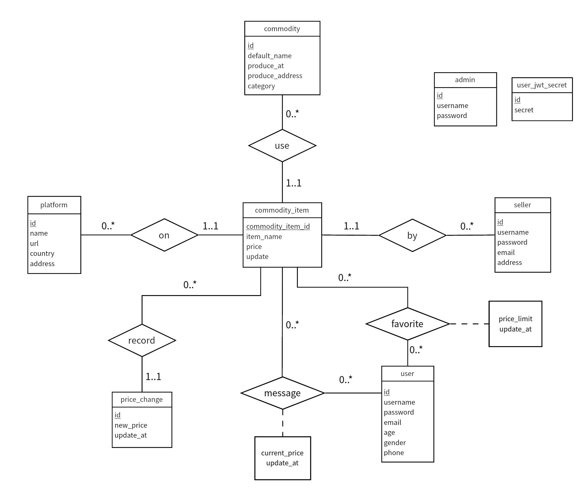
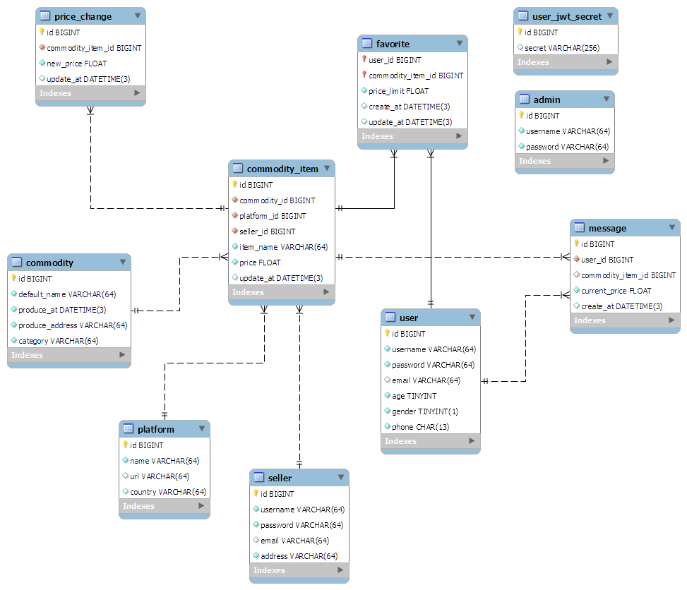
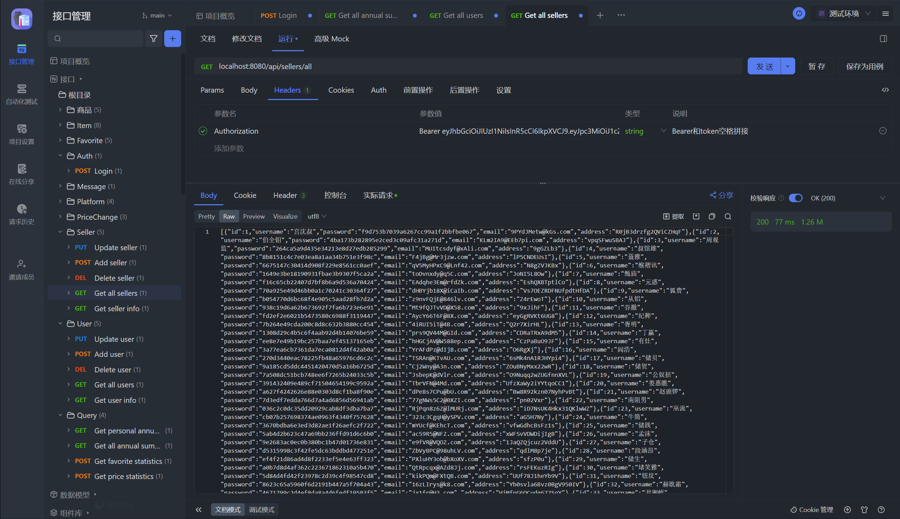
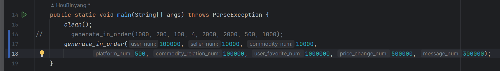
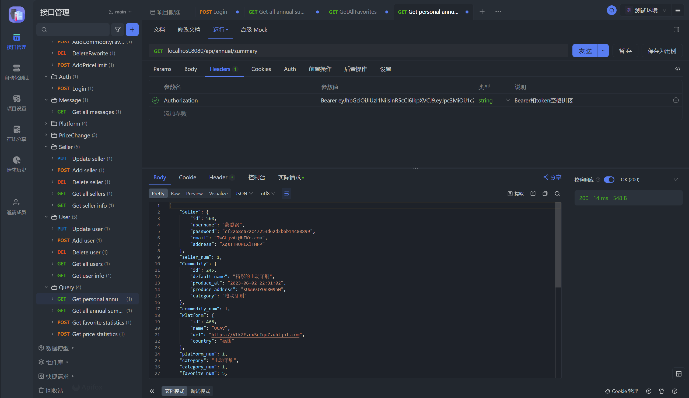
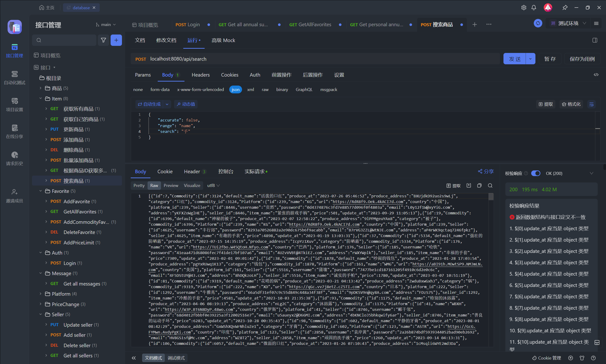
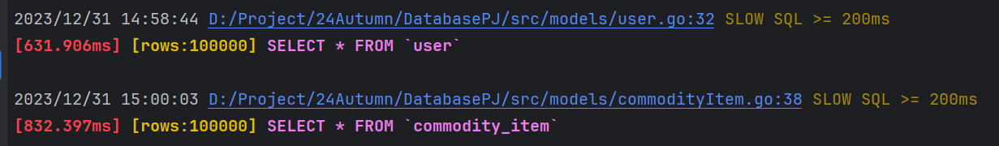
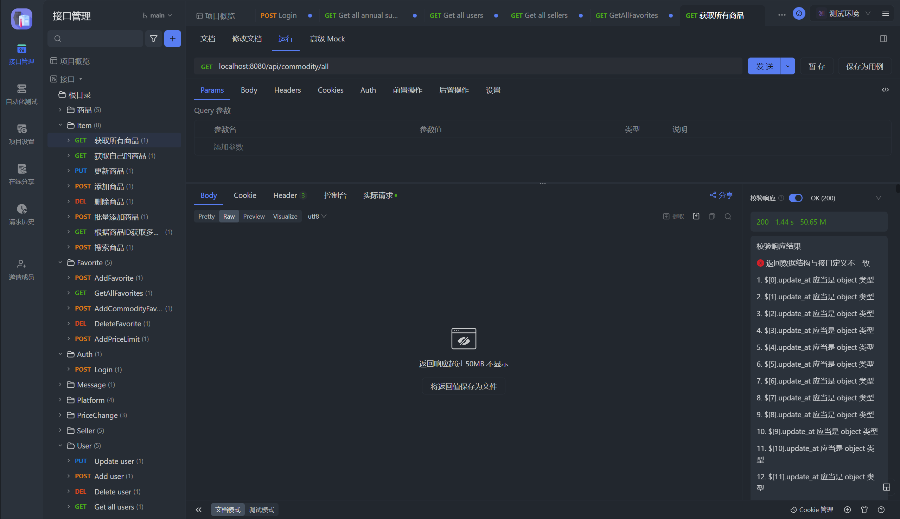
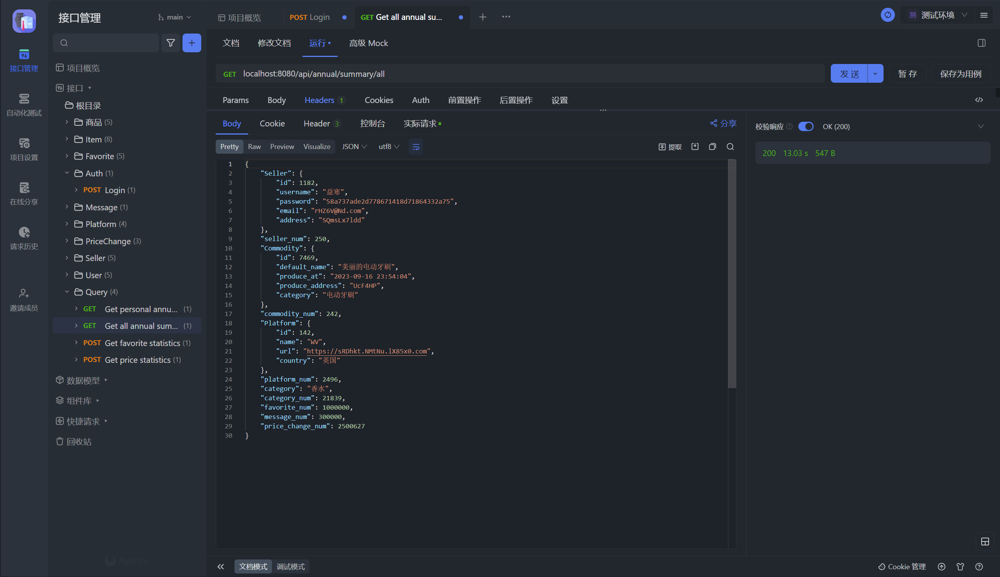

# 1、数据库ER图

### （1）按照书上描述的标准绘制的ER图



### （2）MySQL Workbench生成的ER图 (供参考)



# 2、数据库表结构
建表语句脚本见price_comparator.sql
表结构说明：
- user_jwt_secret存放user token
- user用户
- seller商家
- admin管理员
- platform平台
- commodity商品，包含字段生产日期、生产地、类别、默认名称
- commodity_item单个商品，根据要求 `每一个商品(即id唯一)都属于特定的商家和平台，不存在不限平台和商家的商品`将商品抽象为商品的描述表commodity，而具体每一个商品则在commodity_item中。commodity_item每条记录对应每一个商品即该表中commodity_id，platform_id，seller_id三个外键属性合起来组成主键。表还包含字段名称（对外显示）、当前价格以及为方便起见定义的主键id
- favorite用户收藏表，收藏的对象只能是commodity_item，表中user_id commodity_item_id联合主键，price_limit是设定的提醒价格
- message消息表
- price_change价格变化表，价格变化只能是commodity_item，包含commodity_item_id和新价格
例：iPhone16 pro作为特定的商品，commodity表中记录了对它的描述，而具体到特定的商家和平台的iPhone16 pro则在commodity_item中。

# 3、索引定义
以下默认省略主键索引和外键索引
- admin username登录查询
- commodity default_name、category用户关键词查询
- commodity_item 
	- commodity_id platform_id seller_id联合索引unique 唯一性约束
	- item_name 查询
	- update_at时间排序返回结果
- favorite user_id commodity_item_id联合索引unique 唯一性约束
- message user_id查询
- price_change 
	- commodity_item_id update_at每天更新一次约束
	- commodity_item_id 查询
- seller name登录查询
- user name登录查询


## 核心功能的 SQL 语句
- 收藏统计
```sql
SELECT COUNT(*) AS COUNT, commodity_item_id FROM favorite GROUP BY commodity_item_id ORDER BY COUNT DESC LIMIT 20;
```

- 具体到部分用户的收藏统计
```sql
SELECT COUNT(*) AS COUNT, commodity_item_id FROM favorite LEFT JOIN USER ON favorite.`user_id` = user.`id` WHERE user.`age` BETWEEN 10 AND 50 GROUP BY commodity_item_id ORDER BY COUNT DESC LIMIT 20;
```

- 价格极差统计
```sql
SELECT MAX(new_price) - MIN(new_price) AS price_variance FROM price_change WHERE commodity_item_id = 1 GROUP BY commodity_item_id
```

```sql
select MAX(new_price) - MIN(new_price) as price_variance, commodity_item_id from commodity_item join price_change on commodity_item.id = price_change.commodity_item_id where commodity_id = 54 AND price_change.update_at BETWEEN "2022-01-01 09:26:50.000" AND "2024-01-01 09:26:50.000" Group By commodity_item_id
```

- 年度总结
- 
单一用户收藏中所有商品的价格变动总次数
```sql
select count(*) from favorite left join price_change on price_change.commodity_item_id = favorite.commodity_item_id where favorite.user_id = 1 AND favorite.update_at < price_change.update_at
```

上述查询对全部用户
```sql
SELECT COUNT(*) AS num, user_id FROM favorite LEFT JOIN price_change ON price_change.commodity_item_id = favorite.commodity_item_id WHERE favorite.update_at < price_change.update_at GROUP BY user_id ORDER BY num DESC
```

单一用户收藏次数最多的commodity以及对应的数量（例：在多个平台多个商家收藏了iPhone 15 Pro，但iPhone 15 Pro对应的都是同一个commodity，统计commodity收藏的次数）
```sql
SELECT COUNT(*) AS commodity_num, commodity_id FROM favorite LEFT JOIN commodity_item ON commodity_item.id = favorite.commodity_item_id WHERE user_id = 2 GROUP BY commodity_id ORDER BY commodity_num DESC
```

单一用户收藏次数最多的商家以及对应的数量
```sql
SELECT COUNT(*) AS seller_num, seller_id FROM favorite LEFT JOIN commodity_item ON commodity_item.id = favorite.commodity_item_id WHERE user_id = 2 GROUP BY seller_id ORDER BY seller_num DESC
```

单一用户收藏次数最多的平台以及对应的数量
```sql
SELECT COUNT(*) AS platform_num, platform_id FROM favorite LEFT JOIN commodity_item ON commodity_item.id = favorite.commodity_item_id WHERE user_id = 2 GROUP BY platform_id ORDER BY platform_num DESC
```

单一用户收藏次数最多的种类以及对应的数量（种类是commodity的字段而不是commodity_item的字段）
```sql
SELECT COUNT(*) AS category_num, category FROM favorite LEFT JOIN commodity_item ON commodity_item.id = favorite.commodity_item_id LEFT JOIN commodity ON commodity_item.commodity_id = commodity.id WHERE user_id = 2 GROUP BY category ORDER BY category_num DESC
```

## 触发器
触发器见trigger.sql
每次更新商品价格后，price_change表中新增记录，向每个收藏该商品且价格低于提醒价格的用户发送消息

# 4、运行方式
完整构建方法如下（后端可直接运行main.exe）：
### 环境配置

1. `cd ./client`
`npm install`
下载vue依赖

2. `cd ./src`
`go mod download`
下载go依赖

3. `go install github.com/swaggo/swag/cmd/swag@latest`
`swag init --parseDependency --parseDepth 1`
下载swagger自动生成api文档

### 构建和运行

1. client：在client目录下，命令行执行`npm run dev`即可启动前端，部署在localhost:8070。

2. src：运行`go run main.go`启动后端，部署在127.0.0.1:8080。


# 5、测试数据，功能
### 数据生成和导入

1. GenerateData：运行RunAndGenerate.java即可生成json格式的测试数据

2. 创建数据库表price_comparator

3. 在src/models/init.go 中配置mysql

4. `src/utils/json`目录下运行 `go test` 生成数据库表并导入GenerateData/Data中的数据


- 其中数据库表结构由代码自动生成，您也可以通过price_comparator.sql导入

- 触发器默认使用代码中的hook函数模拟，您也可以由trigger.sql导入

- 若选择使用trigger.sql导入触发器，需要注释掉hook函数即`func (item *CommodityItem) AfterUpdate(tx *gorm.DB) (err error)`


### 功能
全部完成，除商家批量导入接口外，浏览器中登录对应用户（用户名密码在生成数据GenerateData/Data目录下）进行操作即可
商家批量导入可以直接使用apifox传入json格式数据或将数据放在GenerateData/Data文件下，之后再src/utils/json运行go test导入
进阶查询功能包括：
1. 用户年度画像：一年收藏了多少东西，收藏的里面有多少商品价格变动了，系统发送了多少条提醒
2. 系统年度总结：收藏总数 收到消息总数 收藏后价格变动总数 最喜欢的商家、平台、商品、类别

# 6、对系统性能测试或分析的过程
分别对一万、十万和百万级别数据进行了测试，发现除全部读取和全局统计外，其余查询接口表现良好，而全部读取会耗时过长甚至内存溢出

###  一万规模数据
整体表现良好，即使获取全部数据响应时间也控制在100ms

### 十万规模数据

数据集大小


1. 年度总结（需要执行多个sql，处理多个数据库表，且每次查询需要多表连接、聚集函数）响应时间为14ms


2. 模糊查找 响应时间在200ms以内 即使在十万数据规模，对于性能低下的like语句，只要建立合适的索引，其响应速度也可以很快


3. 全部读取
由于vue会尽早响应，而在全部读取时，sql语句执行时间往往接近一秒，会导致网页端仅获取到部分数据


使用apifox获取数据，发现响应时间高到1.44s


对于近50MB的响应数据，在网络传输中往往也会导致大量时延

4. 全局统计
而在管理员全局统计接口，响应时间高达13秒


### 百万规模数据
全部读取接口由于返回数据规模过大导致go内存溢出
数据的插入过程由于外键约束，耗时也会长很多
![[4b120e947563f4fdda0dfc65a0e0f5e.png]]

### 结论
- 在大规模数据集情况下，建立适当的索引对查询速度有明显的改善
- 合适的sql语句可以降低数据库访问次数，减少数据库查询时间
- 但另一方面也要求程序员对sql语句和程序逻辑优化：
	- 不能将接口设计为全部读取，用分页机制调整一次性读取的数据规模。
	- 对于全局统计，应当尽可能拆分接口，每个接口只统计一部分数据而不是将所有数据统计任务都放在一个函数内，以降低每个接口响应的时间，同时尽可能利用并行处理的优势。